# CRISTAL USER GUIDE

CRISTAL is an online knowledge portal to host existing and future datasets for Acute Lymphoblastic Leukaemia clinical trials in the UK.

This User Guide explains how to use the database, describing the process for searching and viewing data as well as demonstrating data entry processes. 

The guide is primarily intended for use by Data Managers entering data derived from standard-of-care case reports for patients enrolled in ALL clinical trials in the UK. However, it may also aid users with Researcher access to the database in viewing, adding or amending patient and sample records for non-trial studies.

To skip to instructions for completing data entry for new trial patients and editing existing patient records, click [here](#the-patient-record).

## CRISTAL HOMEPAGE

On logging in, the user lands at the **Homepage**, which displays the database menu in the sidebar. In the following sections, each menu option is outlined in turn; click the links below to access each section. 

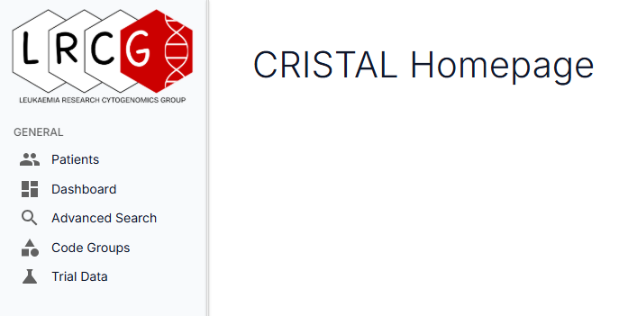

---------------------------------------

## PATIENTS

### PATIENT MANAGEMENT

Selecting **Patients** from the menu opens the **Patient Management** landing page, which gives an overview of patients enrolled in UK clinical trials. The data grid shows the high-level data for each patient, including basic demographic details. 

> **Note:** Personal identifiers in each patient's record such as name, date of birth and NHS number will be hidden for database users with Researcher or Read-only access.
>
> In the screenshot below, the patient identifiers have been redacted.

The **Patient Management** page includes the facility to search for patients, add new patients, and upload patient datasets.

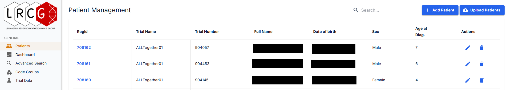

#### SEARCH BOX

Search for a specific patient by entering the RegID, trial number, or patient name or date of birth into the Search box.  

To search the database without using specific patient identifiers - for example, in order to view data on male patients aged between 3 and 5 at diagnosis - navigate to the **Advanced Search** page using the menu. To skip to the **Advanced Search** section of this guide, click [here](#advanced-search).

To view the full patient record, click on the **RegID** on the left of the row. To edit the patient data, click the pencil icon on the right of the row. For more information, skip to the Edit Patient section.

#### ADD PATIENT

> **Adding a new ALLTogether01 patient:**
>
> Data Manager accesses the Castor EDC email from the LRCG NHS.net email inbox.
>
> Using the trial number given in the email, locate the patient record in the **Castor** database.
>
> Navigate to the Baseline section in Castor to view data in the Demography and Informed Consent pages. Required data are Trial start date, Date of diagnosis, Immunophenotype, Eligibility, Consent (Trial and Research).
>
> Add the patient to **CRISTAL** following the general process below.

To create a new patient record, click the **Add Patient** button. The **Create New Patient** dialogue box will open.

Complete the fields using demographic, trial and diagnosis details. 

If any details are not known at this stage - e.g. full name, date of birth, immunophenotype, Down syndrome status - leave the relevant field empty. When more data are available, the patient record can be accessed and edited by navigating to the **PATIENT** tab of the patient record and clicking the **Edit** button.

> **Note:** If the full date of birth is not known (e.g. the **Castor** database records only the month and year of birth), enter a date in the middle of the relevant month - i.e. a **Castor** DOB of Mar 2018 should be entered in **CRISTAL** as 15/03/2018. Tick the **DOB Estimated** box.

If a patient with the same identifiers has already been entered in the database, the following dialogue box will appear stating the reason for the duplicate patient alert. The full patient information can be reviewed by clicking **View Patient** on the alert box.

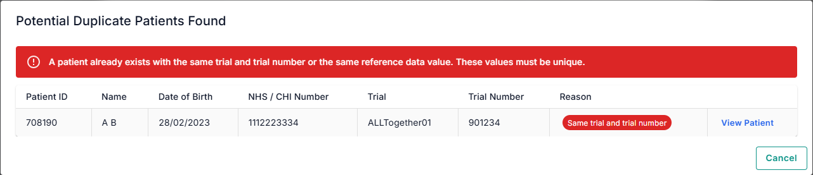

When all of the available details have been entered in the **Create New Patient** dialogue box, click **OK** to save, or to close the box without saving, click **Cancel**.

Clicking **OK** opens the patient record for the new patient. Skip to [the Patient Record](#the-patient-record) section for guidance on entering the patient's case data.

#### UPLOAD PATIENTS

INSERT TEXT

-------------------------------------------------

### THE PATIENT RECORD

The following sections describe and, where helpful, demonstrate the processes for viewing, adding and editing data in an individual patient record. The sections are structured on a tab-by-tab basis and include information on genetic abnormalities, types of tissue sample, and diagnostic techniques.

The guidance is primarily for Data Managers entering data derived from standard-of-care case reports for UK clinical trial patients. The examples in the tab guides are adapted from ALLTogether01 trial data.

There are also links in each tab guide to a Resources section for further information, including a Glossary and a data entry Troubleshooting guide.

For the ALLTogether01 trial, typically the initial patient record is created when the patient is registered on the trial, prior to receiving the diagnostic report. To locate the initial patient record to add the report data, first click on **Patients** in the sidebar to open the **Patient Management** page, then use the **Search** function to enter the patient's name or trial number. Clicking the **RegID** on the returned data grid will open the patient record at the **OVERVIEW** tab.

If the patient record is not found, create the new patient record by following the instructions in the [Add Patient](#add-patient) section.

-----------------------------------

### OVERVIEW TAB

TBC

------------------------------------

### PATIENT TAB

The **PATIENT** tab presents an at-a-glance view of the patient's demographics, diagnosis details, trial participation and consent status, as well as reference data such as NHS and GEL numbers. The data grid is autofilled from the data entered at the **Add Patient** stage.

Full view of the demographic details is only available to users with Data Manager access; patient identifiers will be hidden for Researcher and Read-only users. Personal identifiers in the screenshot below have been redacted.

As part of the data entry process, review the data in the data grid to ensure accuracy. 

To amend the data, click the **Edit** button to open the **Edit Patient** dialogue box and make any necessary changes.

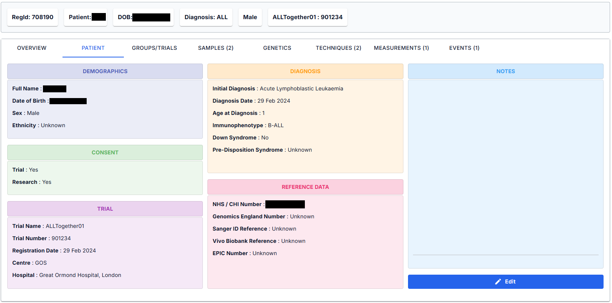

------------------------------------

### GROUPS/TRIALS TAB

The **GROUPS/TRIALS** tab shows the trial-specific (or non-trial study-specific) and code group data. 

The **Trial** data grid is autofilled from data entered when creating the new patient record. 

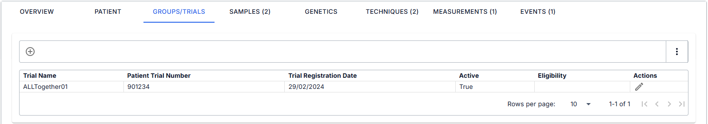

The patient's trial eligibility should be added on this tab - click the pencil on the right of the row to open the **Add Patient Trial** dialogue box, then click the down arrow on the **Trial eligibility** field.

If the trial is no longer active, move the *Active trial* slider to the off position.

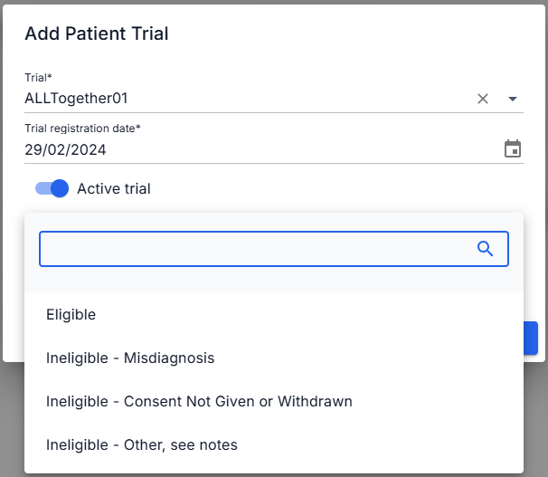

The **Code Group** data grid shows which code groups the patient record is associated with. 

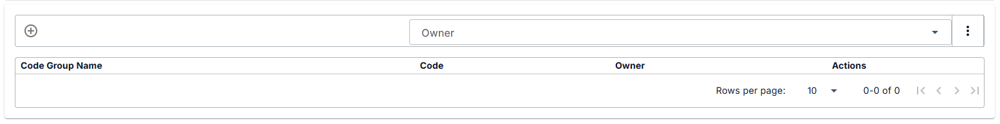

------------------------------------

### SAMPLES TAB

#### VIEW RECORDS

> **Note:** Users with Read-only access can only view existing records and will not be able to edit them or add new sample records - Data Manager or Researcher access is required.

The data grid displays the high-level information for each tissue sample recorded for the patient. To view the full record, click on the pencil icon [TBC] on the right of the row. 

If a tissue sample is stored in the Herschel lab, the details can be viewed by clicking the grid icon on the right of the row.

For information on editing the record, see the data entry instructions in the following section. 

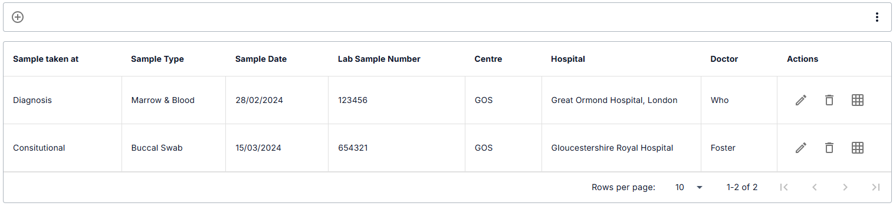

#### ADD AND EDIT SAMPLES

To add a sample, click the ⊕ button above the data grid. To edit an existing sample record, click the pencil icon on the right of the row. 

The **Add Patient Sample** dialogue box will open. 

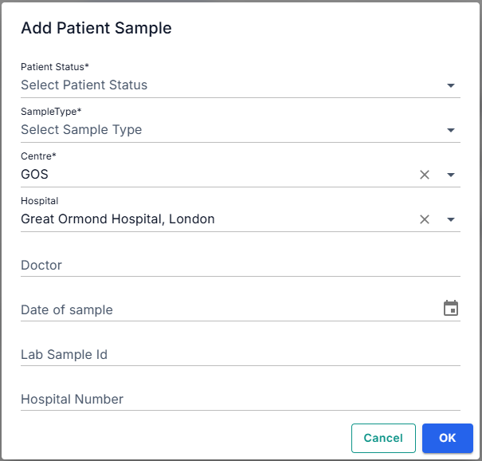

The **Centre** and **Hospital** fields are autofilled from data entered in the **Create New Patient** dialogue box at the start of the data entry process. 

If the diagnostic centre and hospital were not added at the time of creating the new patient record, these fields will be empty. To add this data after the patient record has been created, either select the appropriate options from the drop-down lists in the **Centre** and **Hospital** fields, or navigate to the **PATIENT** tab and click **Edit** to open the **Edit Patient** dialogue box.

Next, select the **Patient Status** from the drop-down list. When entering data from a case report, the patient status will usually be *Diagnosis*.

Select **Sample Type** from the drop-down list. The tissue type can be found in the case report.

> **Note:**
>
> If a case report includes results from bone marrow and peripheral blood samples taken at the same timepoint (i.e. diagnosis), select *Marrow & Blood* instead of adding two separate samples.

Using the details in the case report, complete the **Doctor**, **Date of sample**, **Lab Sample ID** and **Hospital Number** fields.

> **Note:**
>
> The 'Hospital Number' may not be included in the case report, or it may be called 'MRN'.

Click **OK** to save or **Cancel** to close the dialogue box without saving.

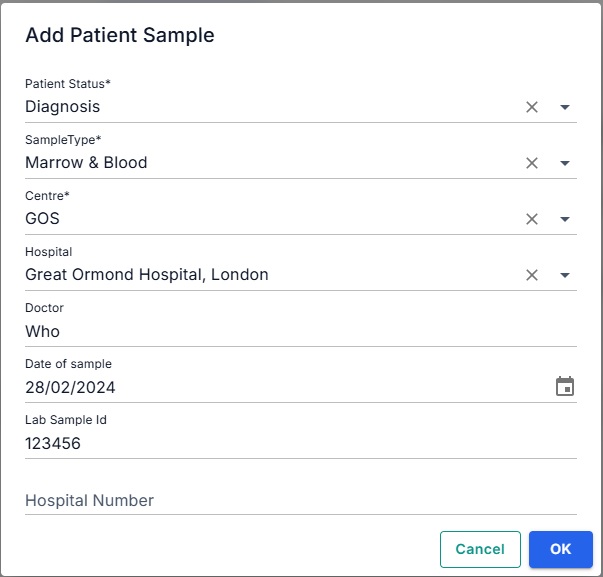

------------------------------------

### GENETICS TAB

#### VIEW RECORDS

> **Note:** Users with Read-only access can only view existing records and will not be able to edit them or add new records - Data Manager access is required.

##### KARYOTYPE
If karyotype data is reported for the patient, it will be displayed in a coloured strip at the top of the tab. The data in this field is automatically generated from data entered in the **TECHNIQUES** tab. 

##### SUBTYPE FROM GENETICS
The data in this field is automatically generated from the abnormality data entered on the **GENETICS** tab.

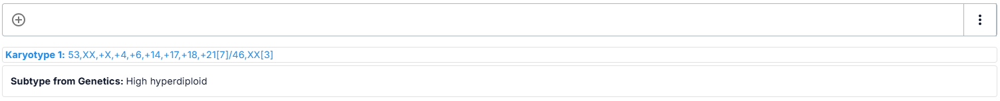

##### ABNORMALITY DATA
The data grid displays the high-level information for each cytogenetic/molecular abnormality recorded for the patient. To view the full record, click on the pencil icon [TBC] on the right of the row. 

For information on editing the record, see the data entry instructions in the following section. 

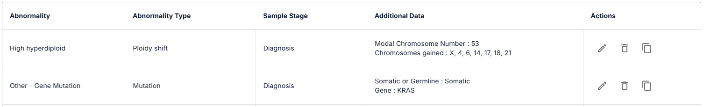

-----------------------

#### ADD AND EDIT GENETIC DATA

The process for adding a Patient Abnormality varies according to type of abnormality. The following subsections outline the basic process for entering each type and include screenshots of example data entry to illustrate. 

The guidance uses examples of basic cases; if the data to be entered do not appear to fit these examples, see the Troubleshooting section for more specific guidance. 

Definitions of the terms used can be found in the [Glossary](#glossary).

Links to headers in this subsection are provided for ease of navigation:

> [Add and edit data record](#add-and-edit-data-record)
>
> - [Sample](#sample)
>
> - [Abnormality Type](#abnormality-type)
>
>    - [Gene Fusion](#gene-fusion)
>
>    - [Copy Number Alteration](#copy-number-alteration)
>
>    - [Mutation](#mutation)
>
>    - [Other](#other) 
>
>    - [Ploidy Shift](#ploidy-shift)
>
>    - [Stuctural Abnormality](#structural-abnormality)
>
>    - [Profile](#profile)

##### ADD AND EDIT DATA RECORD

To edit an existing abnormality record, click on the pencil icon on the right of the row.

###### Screenshot of data grid for high hyperdiploid patient:

To add a genetic abnormality, click the ⊕ button above the data grid. 

###### Screenshot of Add Record button:

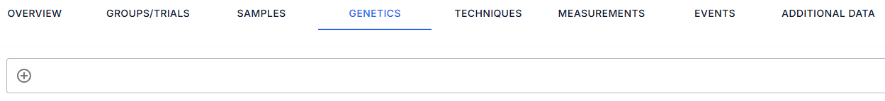

The **Patient Abnormality** dialogue box will open.

##### SAMPLE

Each abnormality entered in CRISTAL must record which tissue sample the abnormality was detected in. Details of the patient's tissue samples should be entered in the **SAMPLES** tab prior to adding abnormality data in the **GENETICS** tab.

To select the sample(s), click on the down arrow on the right of the **Sample** field to open the drop-down list. The data in this field is automatically generated from the data entered on the **SAMPLES** tab.

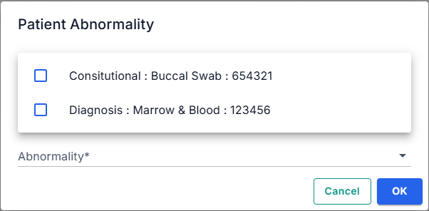

Click in the appropriate box(es) to select, then click **OK** to save or **Cancel** to close the list without saving.

##### ABNORMALITY TYPE
The data entry process for adding a Patient Abnormality varies according to type of abnormality. 

First, select the **Abnormality Type**, either using the drop-down list or by typing in the search box. The abnormality type can be found in the case report. The categories used in CRISTAL are described in the [Glossary](#glossary).

The following sections demonstrate how to add the different abnormality types.

##### *GENE FUSION*

This section describes the process for entering data for a gene fusion or a gene rearrangement. 

> Add 'In brief' section here
> 
> [where to point out that 'chromosomal translocation' is in the Structural Abnormality section?]
> 
> Techniques used to detect gene fusions or rearrangements include karyotyping, FISH, RNA fusion panel and WGS.

Selecting **Gene Fusion** in the **Abnormality Type** field loads a drop-down list in the **Abnormality** field that consists of gene fusions and rearrangements that are frequently found in ALL. To add a gene fusion/rearrangement that is not in the list, the *Other - Gene Fusion* option should be used. The data entry processes for a listed gene fusion, gene rearrangement and 'other - gene fusion' are outlined in the following subsections.

To view the drop-down list of frequently found gene fusions and rearrangements, click the down arrow on the **Abnormality** field.

Select the gene fusion either by using the drop-down list or by typing in the search box.

If a gene fusion (e.g. *ETV6::RUNX1*) is selected from the list, the **5’ Gene** and **3’ Gene** fields will be autofilled. 

If specified in the case report, enter the exons for each gene into the appropriate fields.

If applicable, enter any clinically relevant information in the **Notes** field.

Click **OK** to save or **Cancel** to close the dialogue box without saving.

###### Example: ETV6::RUNX1, detected by FISH, RNA fusion panel, WGS

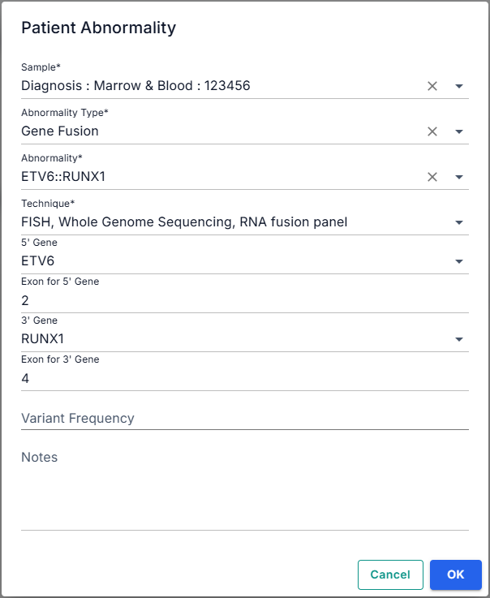

If a gene rearrangement (e.g. *KMT2A-r*) is selected from the list, the relevant gene field will be autofilled.

Enter the partner gene into the appropriate field.

If specified in the case report, enter the exons for each gene into the appropriate fields.

If applicable, enter any clinically relevant information into the **Notes** field.

Click **OK** to save or **Cancel** to close the dialogue box without saving.

###### Example: KMT2A::MLLT3, detected by WGS, RNA fusion panel

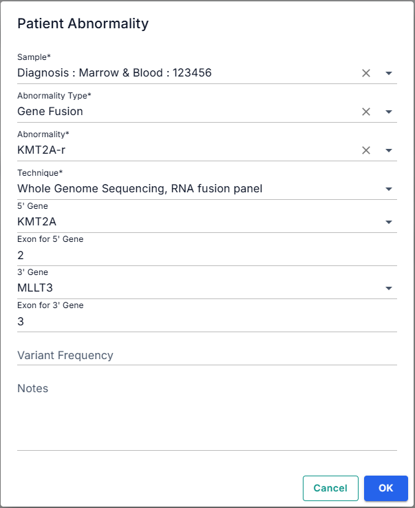

If the case report includes a gene fusion that is not in the drop-down list, select **Other – Gene Fusion**.

Enter the name of the 5’ gene and 3’ gene into the appropriate fields.

> **Identifying 5' and 3' genes:**
>
> The case report should use the convention for gene fusion naming which places the 5’ gene first, separated from the 3’ gene by two colons, i.e. *ABC1::DEF2*.
>
> If unsure, check the [Gene Fusions](Resources.md#gene-fusions) table in [Resources](#Resources), which lists frequently found fusions.
>
> **Note:**
>
> The case report may use old names for genes which have been renamed, for example: *KMT2A* (new) is often referred to as *MLL* (former name). Entering *MLL* in the **5' Gene** search box will bring up *KMT2A* at the top of the returned list.

If specified in the case report, enter the exons for each gene into the appropriate fields.

If applicable, enter any clinically relevant information into the **Notes** field.

Click **OK** to save or **Cancel** to close the dialog box without saving.

[Return to top of section](#add-and-edit-genetic-data)

##### *COPY NUMBER ALTERATION*

This section describes the process for entering data on changes in copy number, i.e. chromosomal gains and losses or deletions.

> **In brief:**
>
> A copy number alteration (also copy number variation) is a change in the expected number of copies of a gene or (a part of) a chromosome (i.e. more or fewer than 2). A copy number of 1 or 0 may be referred to in case reports as a loss or a deletion, which may be monoallelic or biallelic. Typically 'loss' refers to a whole chromosome and 'deletion' refers to part of a chromosome, but case reports vary in their use of the terms. A copy number greater than 2 will be referred to as a gain. A gain of 1 extra copy of a gene or chromosome (i.e. 3 copies in total) is known as trisomy, 2 extra copies is tetrasomy, and so on. Multiple extra copies of a segment of a chromosome may be classed as amplification.
>
> Techniques used to detect CNAs include karyotyping, FISH, SNP array and whole genome sequencing.
> 
> **Note:**
>
> Gains or losses of multiple chromosomes in a cell is termed a [ploidy shift](#glossary#ploidy-shift). The process for entering data on ploidy shifts is described in a [later section](#ploidy-shift).

After ensuring the **Sample** field is correct and selecting Copy Number Alteration in the **Abnormality Type** field, open the drop-down list in the **Abnormality** field and select the appropriate option:
- *Whole Chromosome* if the CNA is a gain or loss of an entire chromosome,
- *Chromosome Arm* if the CNA affects only part of a chromosome - either the short (p) arm or the long (q) arm,
- *Focal* if the CNA relates to gain or deletion of a specific gene or genes, or a very small part of a chromosome (typically smaller than 1 Mb).

Select the relevant option(s) from the drop-down list in the **Technique** field. Details of the techniques used to detect the abnormality can be found in the case report.

Select the correct subtype in the **CNA Type** field. This information can be found in the case report. (Further information on the CNA types - deletion (monoallelic and biallelic), duplication, gain, amplification, loss of heterozygosity, isochromosome and loss - can be found in the Glossary.)

In the remaining fields, enter the copy number, affected chromosome/chromosome arm, any genes that are specified in the report, exons (if included in the report), chromosome start and end points, chromosome size, genomic start and end points, genomic size, and variant frequency (VAF) in the relevant fields. Note that case reports vary in the amount and type of information included.

Enter any clinically relevant information into the **Notes** field.

Click **OK** to save or **Cancel** to close the dialogue box without saving.

###### Example: CNA - biallelic deletion on 9p involving genes CDKN2A and CDKN2B, detected by WGS and SNP array

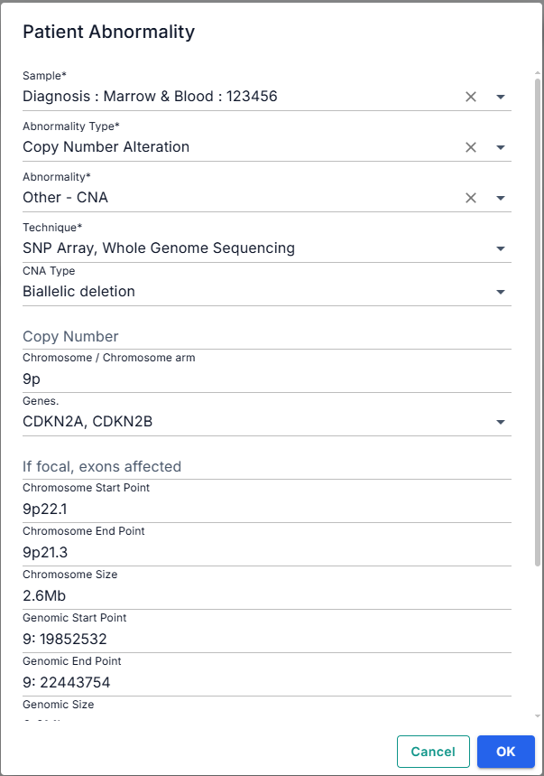

[Return to top of section](#add-and-edit-genetic-data)

##### *MUTATION*

This section describes the process for entering data on genetic mutations (variants).

> **In brief:**
>
> Also known as a variant, mutation occurs when there is a substitution of one nucleotide for another in the DNA sequence. This can result in the coding of a different amino acid (missense variant) leading to production of an incorrect protein, or it may stop the coding (nonsense variant, called 'stop codon' in CRISTAL) resulting in non-production of the protein.
>
> [add Somatic vs Germline explanation]
> 
>  As shown below, the case report will include details of the affected gene, the location, the nucleotide substitution ('coding change' in CRISTAL) and the change in amino acid ('protein change' in CRISTAL).
>
> | Gene | Location | Coding change | Protein change |
> | --- | --- | --- | --- |
> | *KRAS* | NM_004985.5 | c.436G>A | p.(Ala146Thr) |
>
> Techniques used to detect genetic variants or mutations include DNA sequencing and whole genome sequencing. 

Select the specific mutation from the drop-down list; if it is not listed, select **Other – Gene Mutation**.

Select the technique(s) used to detect the abnormality.

From the drop-down lists, select Somatic or Germline, specify the affected gene, and mutation type if specified.

Enter the genomics change (if specified), coding change, and protein change.

Select the classification from drop-down list if specified.

Complete the **Variant Frequency** field.

Enter any clinically relevant information into the **Notes** field.

Click **OK** to save or **Cancel** to close the dialog box without saving.

###### Example: germline missense variant of uncertain significance in the BRCA2 gene

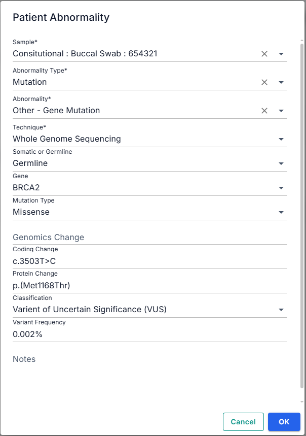

[Return to top of section](#add-and-edit-genetic-data)

##### *OTHER*

TEXT HERE

SCREENSHOT HERE

LINK HERE

##### *PLOIDY SHIFT*

Select the type of [ploidy shift](glossary#ploidy-shift) from the drop-down list.

Select the technique(s) used to detect the abnormality.

In the appropriate fields, enter the modal chromosome number, specify which chromosomes have been gained and/or which chromosomes have been lost.

> **Note:** chromosome numbers should be entered in numerical order, with X and/or Y at the start of the list (if applicable). 

Complete the **Variant Frequency** field.

Enter any clinically relevant information in the **Notes** field.

Click **OK** to save or **Cancel** to close the dialog box without saving.

###### Example: high hyperdiploidy (HeH) with 53 chromosomes, detected by karyotype, FISH, WGS and SNP

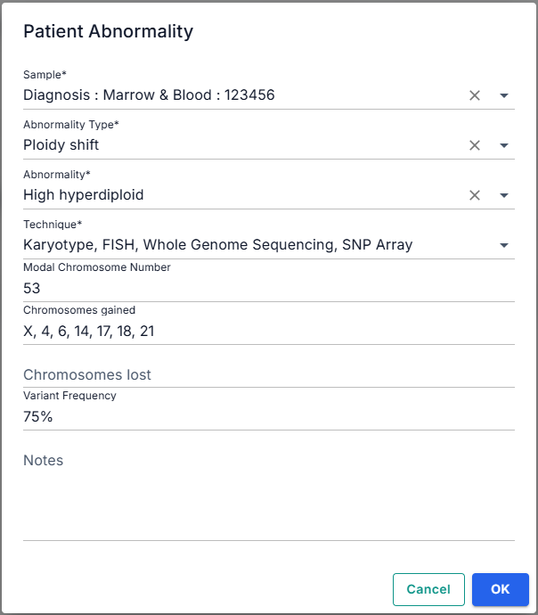

[Return to top of section](#add-and-edit-genetic-data)

##### *STRUCTURAL ABNORMALITY*

TEXT HERE

SCREENSHOT HERE

LINK HERE

##### *PROFILE*

> **In brief:**
>
> The CNA Risk Profile is

Case reports for ALLTogether01 patients will include the CNA Risk Profile, categorising the patient as either **Good Risk** or **Poor Risk**. If this information is not included in the report, use the ALLTogether01 algorithm shown [below](#cna-risk-profile-algorithm) to determine the Risk Profile from the information in the case report regarding deletion of [ALL genes](#all-genes). 

> **Note:**
>
> Risk Profile is only calculated for B-ALL patients.
>
> Different risk algorithms are used for the different trials. The algorithm shown below is for the current ALLTogether01 trial.

**Abnormality Type** list - select **Profile**.

**Abnormality** field - select **UKALL CNA Profile**. 

**CNA Result** field - select **Good Risk** or **Poor Risk**.

Enter any clinically relevant information in the **Notes** field.

Click **OK** to save or **Cancel** to close the dialogue box without saving.

###### Example: CNA Risk Profile of patient with isolated CDKN2A/B deletion - Poor Risk

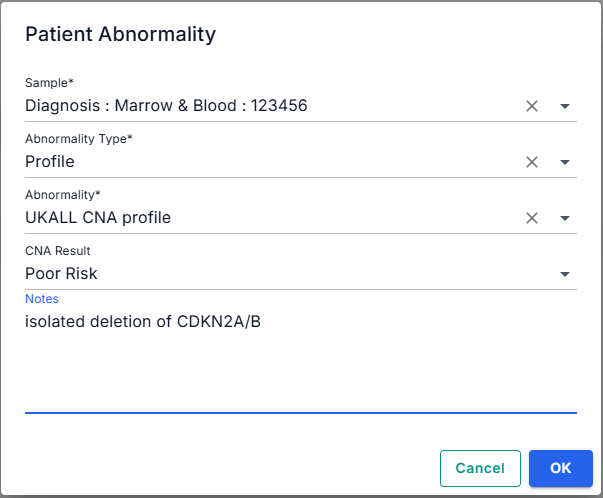

###### CNA Risk Profile algorithm

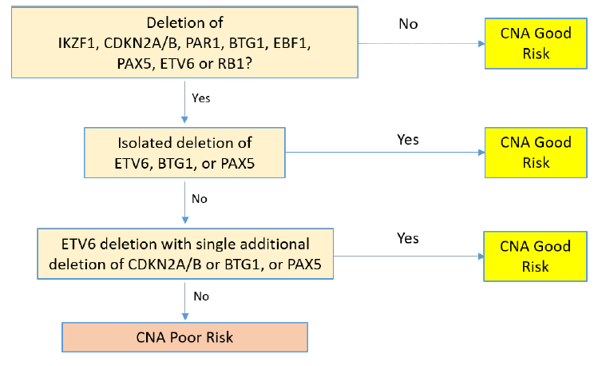

###### ALL Genes

[Return to top of section](#add-and-edit-genetic-data)

### TECHNIQUES TAB

-------------------------------------------------------------

### MEASUREMENTS TAB

-------------------------------------------------------------

### EVENTS TAB

-------------------------------------------------------------

## Dashboard

## Advanced Search

## Code Groups

## Trial Data

--------------------------------

### RESOURCES

#### Reference materials for use with CRISTAL data entry guide

### ALL genes

| Gene                                     | Chromosome location |
| ---------------------------------------- | ------------------- |
| EBF1                                     | 5q33.3              |
| IKZF1                                    | 7p12.2              |
| CDKN2A                                   | 9p21.3              |
| CDKN2B                                   | 9p21.3              |
| PAX5                                     | 9p13.2              |
| ETV6                                     | 12p13.2             |
| BTG1                                     | 12q21.33            |
| ERG                                      | 21q22               |
| RB1                                      | 13q14.2             |
| PAR1 region: CSF2RA IL3RA P2RY8 | Xp22 or Yp11        |

### Gene fusions

| Gene Fusion    | 5' Gene                                     | 3' Gene                                                                  |
| -------------- | ------------------------------------------- | ------------------------------------------------------------------------ |
| ETV6::RUNX1    | ETV6                                        | RUNX1                                                                    |
| TCF3::PBX1     | TCF3                                        | PBX1                                                                     |
| BCR::ABL1      | BCR                                         | ABL                                                                      |
| TCF3::HLF      | TCF3                                        | HLF                                                                      |
| PICALM::MLLT10 | PICALM                                      | MLLT10                                                                   |
| IG::MYC        | All partners .e.g IGH, IGL, IGK             | MYC                                                                      |
| IGH::IL3       | IGH                                         | IL3                                                                      |
| UBTF::ATXN7L3  | UBTF                                        | ATXN7L3                                                                  |
| KMT2A-r        | KMT2A                                       | All partners e.g. AFF1, AFF4 etc                                         |
| PAX5-r         | All partners, e.g. AUTS2                    | PAX5                                                                     |
| CRLF2-r        | All partners, e.g. IGH, PR2Y8               | CRLF2                                                                    |
| DUX4-r         | All partners, e.g. IGH, ERG                 | DUX4                                                                     |
| JAK2-r         | All partners, e.g. PAX5, ETV6               | JAK2                                                                     |
| PDGFRB-r       | All partners, e.g. EBF1, ETV6               | PDGFRB                                                                   |
| ABL1-r         | All partners, e.g. ETV6, NUP214             | ABL1                                                                     |
| ABL2-r         | All partners, e.g. ETV6, ZC3HAVI, RCSD1     | ABL2                                                                     |
| CSF1R-r        | All partners, e.g. SSBP2, MEF2D             | CSF1R                                                                    |
| ZNF384-r       | All partners, e.g. TCF3, EP300              | ZNF384                                                                   |
| NUTM1-r        | All partners, e.g. BRD3, BRD9, ACIN1        | NUTM1                                                                    |
| TLX3-r         | All partners , e.g. TRA/D, TRB, TRD, BCL11B | TLX3                                                                     |
| TAL1-r         | All partners , e.g. TRA/D, TRB, TRD, BCL11B | TAL1                                                                     |
| TLX1-r         | All partners , e.g. TRA/D, TRB, TRD, BCL11B | TLX1                                                                     |
| LMO1/2-r       | All partners , e.g. TRA/D, TRB, TRD, BCL11B | LMO1/2                                                                   |
| NKX2-1-r       | All partners , e.g. TRA/D, TRB, TRD, BCL11B | NKX2-1                                                                   |
| LYL1-r         | All partners , e.g. TRA/D, TRB, TRD, BCL11B | LYL1                                                                     |
| CEBP-r         | All partners .e.g IGH, IGL, IGK             | CEBP                                                                     |
| EPOR-r         | All partners .e.g IGH, IGL, IGK             | EPOR                                                                     |
| ID4-r          | All partners .e.g IGH, IGL, IGK             | ID4                                                                      |
| MEF2D-r        | MEF2D                                       | All partners (except CSF1R), e.g. BCL9                                   |
| ETV6-r         | ETV6                                        | All partners (except RUNX1, JAK2, PDGFRB, ABL1, ABL2), e.g. NTRK3, NCOA2 |

-------------------------------------------------------------

### GLOSSARY

#### Definitions of terms and abbreviations used in CRISTAL database and case reports

### aneuploidy
Presence of abnormal number of chromosomes in a cell; may be more or fewer chromosomes than the usual number of 46. 

See also [ploidy shift](#ploidy-shift), [high hyperdiploidy](#high-hyperdiploidy), [low hypodiploidy](#low-hypodiploidy), [near haploidy](#near-haploidy)

### BCR::ABL1
See [Ph+ ALL](#ph+-all)

### breakpoint

### clone

### CNA Profile

### CN-LOH

### code group

### codon

### complex chromosome
See also subcategories listed under [structural abnormality](#structural-abnormality)

### constitutional

### copy number

### copy number alteration

### event
A dated patient milestone such as diagnosis, relapse or death.

### exon

### FISH
Fluorescent *in situ* hybridisation

### focal

A type of [copy number alteration](#copy-number-alteration) that affects a very small part of the chromosome - typically less than 1 Mb - and results in the gain or deletion of one or only a few genes.

### gene fusion

### gene rearrangement

### germline

### HeH
See [high hyperdiploidy](#high-hyperdiploidy)

### high hyperdiploidy
modal chromosome number of 51-65 chromosomes in a cell.
ALL patients with HeH have non-random gains of chromosomes - most frequently gained chromosomes are X, 4, 6, 10, 14, 17, 18 and 21.

### HPA code

### iAMP21

### immunophenotype

### induction

### isochromosome
Definition: @@@@@

Entered in CRISTAL as Copy Number Alteration.

### karyotype

### loss of heterozygosity

### low hypodiploidy

### minimal residual disease
See [MRD](#mrd)

### modal chromosome number

### MRD

### mutation

### near haploidy

### oncogene

### PAR1 deletion
A deletion in the PAR1 region of the X or Y chromosome resulting in the P2RY8::CRLF2 fusion.
> Note: the terminology in a case report may use either *PAR1 deletion* or *P2RY8::CRLF2 fusion* for this abnormality - it should be entered in CRISTAL as a gene fusion, not a deletion.

### ploidy shift

### Ph+ ALL
Subtype of ALL characterised by the so-called Philadephia (Ph) chromosome, which results from a reciprocal translocation between 9q and 22q. May be written as t(9;22) in a case report. The translocation leads to the formation of the BCR::ABL1 fusion gene. 
> Note: patients with BCR::ABL1 are ineligible for ALLTogether01.

### relapse

### somatic

### structural abnormality
Definition: adlkj ;bn;oafj

CRISTAL subcategories: [iAMP21](#iamp21), chromothripsis, chromoanasynthesis, chromoplexy, intrachromosomal rearrangements, ring chromosomes, dicentric chromosomes, double minutes, chromosomal translocation, inversion

### subclone

### translocation

### variant

### Variant Allele Frequency (VAF)

### WGS
Whole genome sequencing. 

